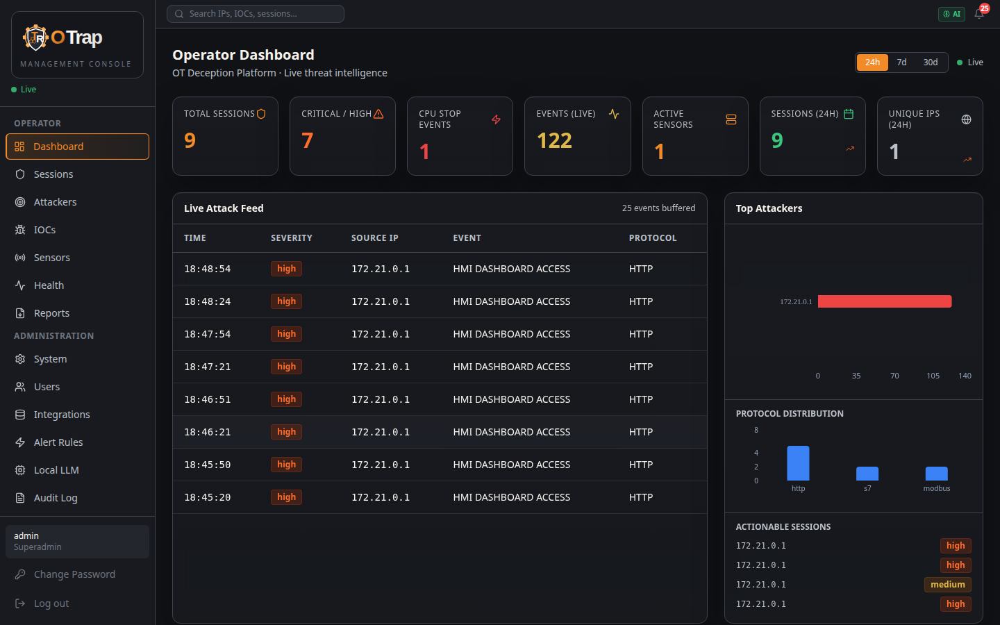
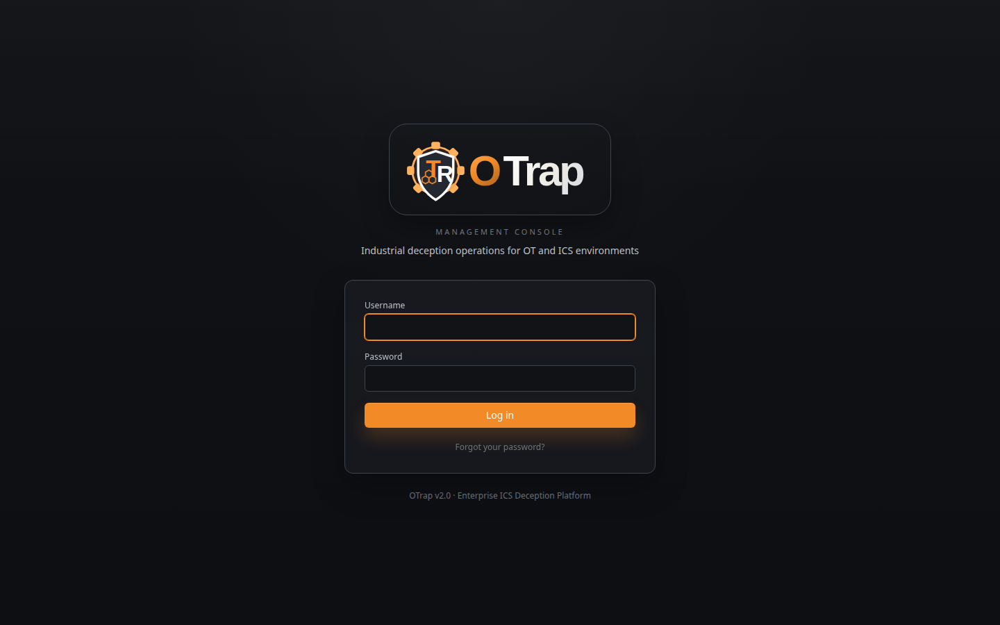
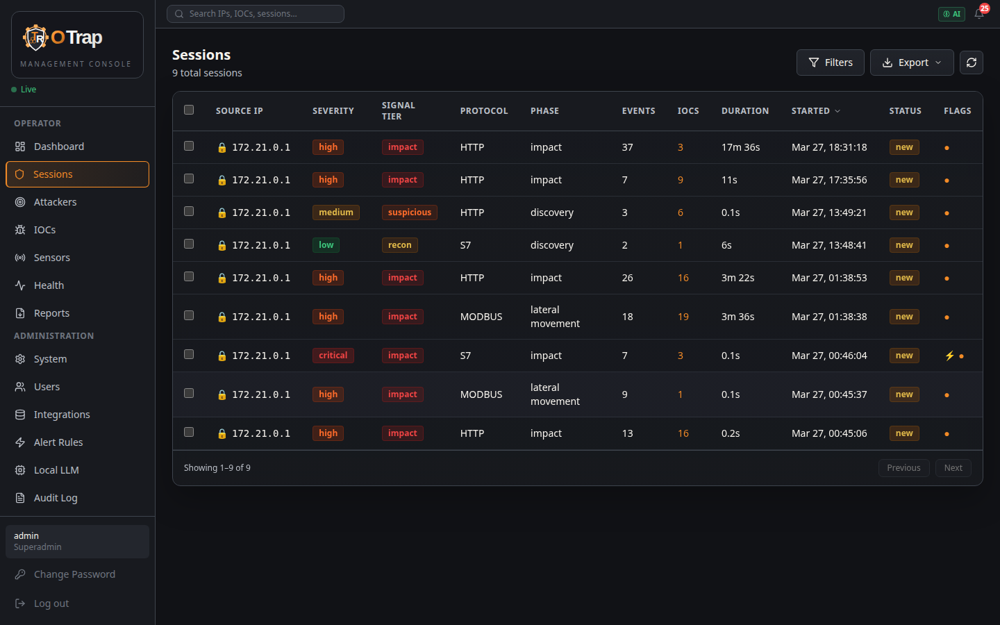
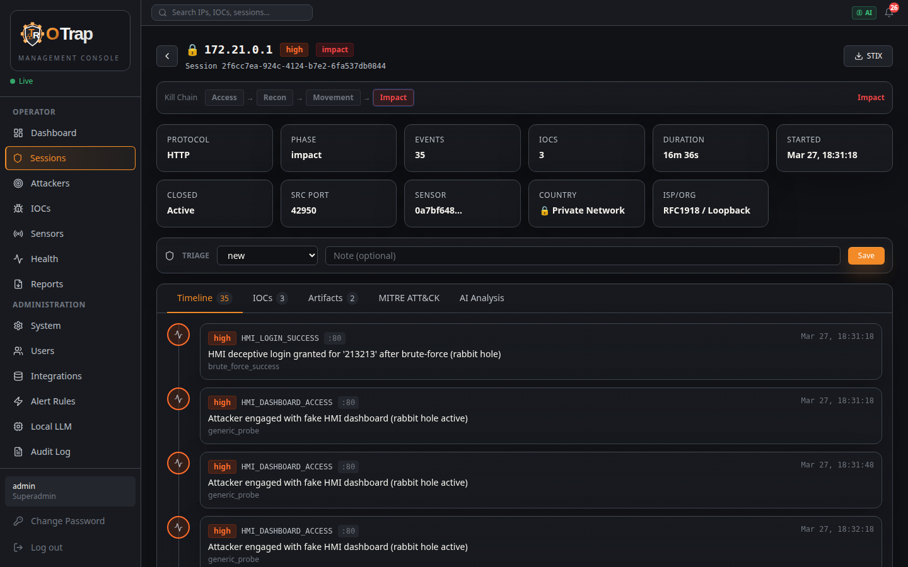
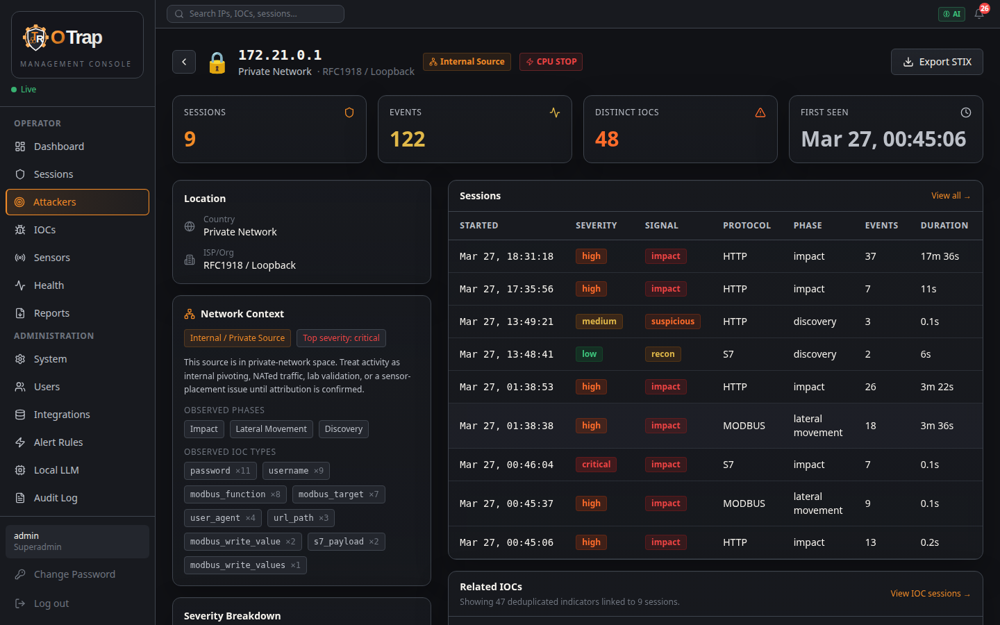
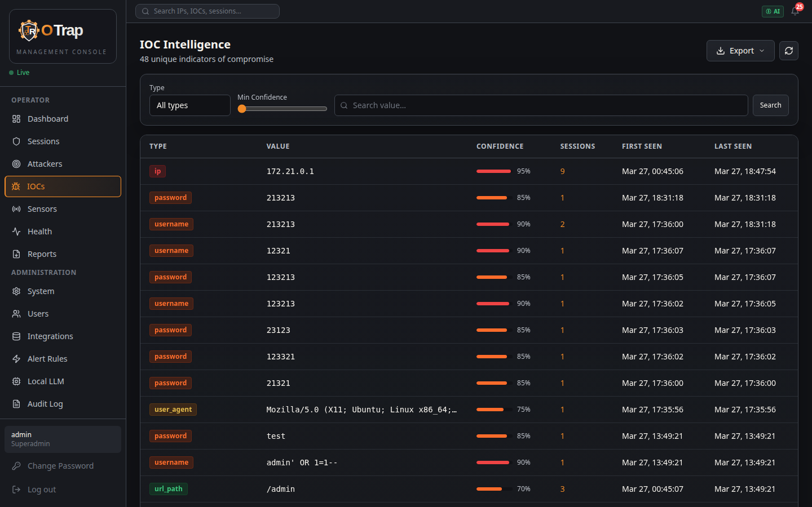
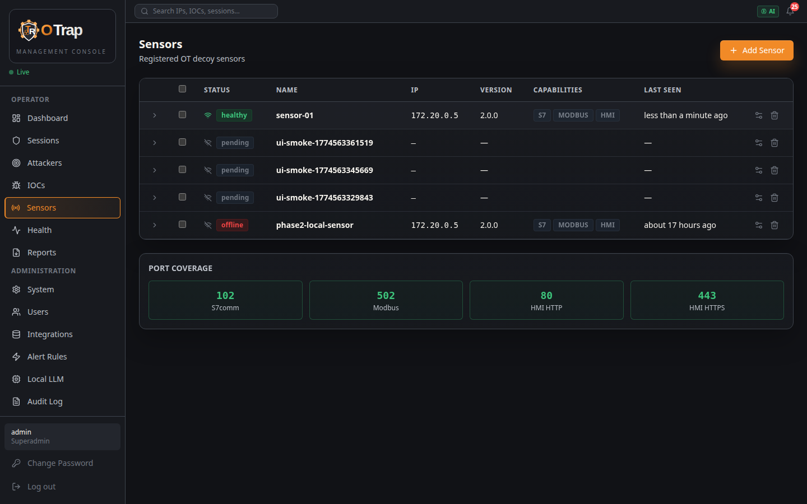
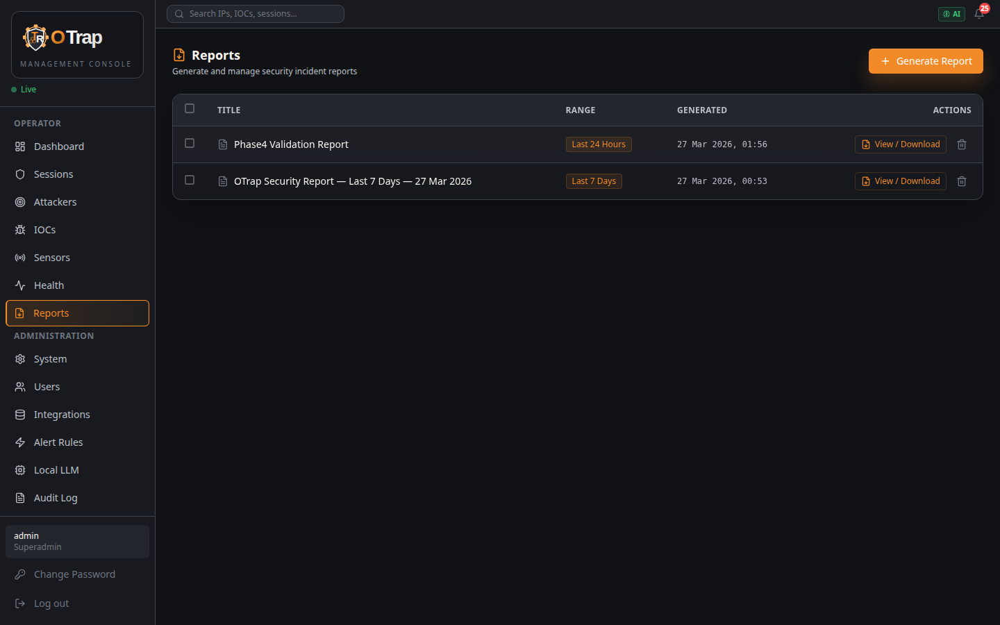
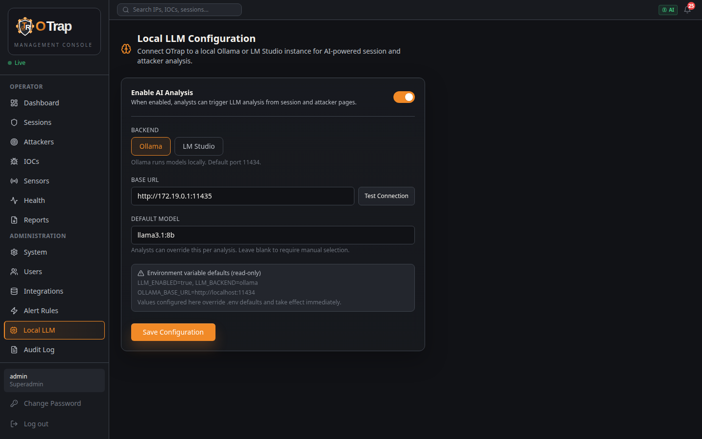

# OTrap — ICS/OT Honeypot Intelligence Platform

[](LICENSE)
[](sensor/)
[](manager/)
[](ui/)
[](docker-compose.yml)

OTrap is a distributed ICS/OT honeypot platform that deploys stateful protocol emulators (Siemens S7-300/400, Modbus/TCP, EtherNet/IP, HMI) to detect and profile adversarial activity in industrial networks. A gRPC-based sensor mesh reports to a central FastAPI manager with a Next.js SOC console.



---

## ✨ Features

**Honeypot Protocols**
- **Siemens S7comm** — stateful PLC emulation with persistent memory map (CPU STOP, DB read/write, system status)
- **Modbus/TCP** — 8 function codes (read/write coils, holding registers, input registers)
- **EtherNet/IP** — CIP identity and list services
- **HMI HTTP/HTTPS** — realistic login portal with OWASP probe detection and brute-force logging

**Detection & Intelligence**
- MITRE ATT&CK for ICS tactic/technique mapping per session
- IOC extraction (IPs, domains, URLs, credentials, payloads, hashes)
- GeoIP enrichment with ASN and country data
- Threat intelligence integration (GreyNoise, AbuseIPDB)
- Kill chain phase detection (reconnaissance → impact)
- STIX 2.1 export per session and per attacker

**Sensor Mesh**
- Go binary sensor with gRPC + mTLS communication
- Sensors dial out to manager — no inbound management ports required
- Per-sensor dynamic certificate issuance via internal CA
- Single-use join tokens with configurable TTL
- Real-time CPU, memory, and event buffer telemetry

**SOC Management Console**
- Live event feed with Server-Sent Events streaming
- Sessions, attacker profiles, IOC inventory, sensor health
- AI-powered session analysis and triage assist (Ollama / LM Studio)
- PDF report generation
- Multi-operator RBAC with full audit log

**Integrations**
- SMTP alert emails with severity filtering and cooldown
- SIEM forwarding: Splunk HEC, Generic Webhook, Syslog/CEF (STIX-compatible)
- Local LLM: Ollama and LM Studio (OpenAI-compatible API)

---

## 📸 Screenshots

| | |
|:---:|:---:|
|  |  |
| *Login* | *Sessions* |
|  |  |
| *Session Detail & Kill Chain* | *Attacker Profile* |
|  |  |
| *IOC Inventory* | *Sensor Health* |
|  |  |
| *PDF Report Generation* | *Local LLM Configuration* |

---

## 🏗️ Architecture

```
OT Network                           Management Network
────────────────────                 ──────────────────────────────────────
OTrap Sensor (Go)   ──gRPC/mTLS──▶  OTrap Manager (FastAPI)
  :102  S7comm                         :8080  REST API + SSE
  :502  Modbus/TCP                     :9443  gRPC (sensor mesh)
  :80   HMI HTTP                     PostgreSQL 16    (sessions, IOCs, audit)
  :443  HMI HTTPS                    Redis 7          (pub/sub, caching, health)
                                     Next.js UI :3000 (SOC console)
                                     LLM Engine :8001 (optional, Ollama)
```

**Key design decisions:**
- Sensors initiate all connections outbound — no inbound firewall rules needed on the sensor host
- Per-sensor mTLS certificates issued at join time; CA private key never leaves the manager
- Stateful S7 memory map: attacker writes are readable back, producing convincing PLC behavior
- CPU STOP returns a plausible ACK (never RST) to preserve the deception

---

## 🚀 Quick Start

```bash
git clone https://github.com/Janberkb/otrap.git
cd otrap
cp .env.example .env
./scripts/install_manager.sh
```

The installer generates all secrets, starts all services, and prints the admin credentials. Open `http://localhost:3000` to access the console.

---

## 📦 Installation

### Prerequisites

| Requirement | Version | Notes |
|---|---|---|
| Docker Engine | 24+ | `docker --version` |
| Docker Compose | v2 | `docker compose version` (note: no dash) |
| Git | Any | For cloning |
| Python 3 | 3.8+ | Used by the installer script only |

**Ports that must be free on the management server:** `3000` (UI), `8080` (API), `9443` (gRPC)

**Ports that must be free on the sensor host:** `102` (S7comm), `502` (Modbus), `80` (HMI HTTP), `443` (HMI HTTPS)

---

#### Installing Docker

<details>
<summary><b>Ubuntu / Debian</b></summary>

```bash
# Remove old versions
sudo apt remove -y docker docker-engine docker.io containerd runc 2>/dev/null || true

# Install prerequisites
sudo apt update
sudo apt install -y ca-certificates curl gnupg

# Add Docker's official GPG key
sudo install -m 0755 -d /etc/apt/keyrings
curl -fsSL https://download.docker.com/linux/ubuntu/gpg | \
  sudo gpg --dearmor -o /etc/apt/keyrings/docker.gpg
sudo chmod a+r /etc/apt/keyrings/docker.gpg

# Add the repository
echo "deb [arch=$(dpkg --print-architecture) signed-by=/etc/apt/keyrings/docker.gpg] \
  https://download.docker.com/linux/ubuntu $(. /etc/os-release && echo "$VERSION_CODENAME") stable" | \
  sudo tee /etc/apt/sources.list.d/docker.list > /dev/null

# Install Docker Engine + Compose plugin
sudo apt update
sudo apt install -y docker-ce docker-ce-cli containerd.io docker-buildx-plugin docker-compose-plugin

# Add your user to the docker group (log out and back in after this)
sudo usermod -aG docker $USER
```

</details>

<details>
<summary><b>macOS</b></summary>

Install [Docker Desktop for Mac](https://docs.docker.com/desktop/install/mac-install/).

Docker Desktop includes both the engine and the Compose plugin. After installation, ensure `docker compose version` works in your terminal.

</details>

<details>
<summary><b>Windows (WSL2)</b></summary>

1. Install [Docker Desktop for Windows](https://docs.docker.com/desktop/install/windows-install/) with WSL2 backend enabled.
2. In Docker Desktop → Settings → Resources → WSL Integration: enable your WSL2 distro.
3. Open a WSL2 terminal (Ubuntu recommended) and verify:
   ```bash
   docker compose version
   ```
4. Continue with the Linux instructions inside WSL2.

</details>

---

### Scenario A — Single Host (Local / Lab)

All services — manager, database, cache, UI, and a local sensor — run on one machine.

**Step 1 — Clone the repository**

```bash
git clone https://github.com/Janberkb/otrap.git
cd otrap
```

**Step 2 — Configure environment**

```bash
cp .env.example .env
```

Open `.env`. For a quick local start you can leave all `CHANGE_ME` values as-is — the installer auto-generates strong secrets. If you want to set your own admin password:

```dotenv
INITIAL_ADMIN_PASSWORD=YourStrongPasswordHere
```

**Step 3 — Install the manager**

```bash
./scripts/install_manager.sh
```

The installer:
1. Verifies Docker + Compose are available
2. Generates all missing secrets in `.env`
3. Checks that ports 3000, 8080, 9443 are free
4. Starts `postgres`, `redis`, `manager`, and `ui`
5. Waits up to 3 minutes for the manager to become healthy
6. Extracts and persists the gRPC CA (`GRPC_CA_KEY_B64`, `GRPC_CA_CERT_B64`) into `.env`
7. Prints admin credentials and the management URL

At the end you will see:
```
✓ Manager install complete
  Management UI:  http://localhost:3000
  Manager API:    http://localhost:8080/api/v1
  Admin user:     admin
  Admin password: <generated>
```

**Step 4 — Open the UI**

Navigate to `http://localhost:3000` and log in.

**Step 5 — Add a local sensor (optional)**

```bash
# Generate a join token
ADMIN_PASS=<your-admin-password> SENSOR_NAME=local-sensor make sensor-token

# Add the printed token to .env:
#   SENSOR_JOIN_TOKEN=<token>
#   SENSOR_INSECURE_JOIN=true   (already set)

# Start the sensor
docker compose up -d sensor
```

The sensor appears as **active** on the Sensors page within seconds.

---

### Scenario B — Multi-Host (Production)

The manager runs on a dedicated management server; one or more sensors run on machines inside OT network segments.

**B1 — Install the manager** (follow Scenario A Steps 1–4, skip sensor)

**B2 — Configure the manager for remote sensors**

The manager's gRPC port must be reachable from sensor hosts. Edit `.env` on the management server:

```dotenv
GRPC_HOST=192.168.1.10                   # Management server IP, reachable from sensor hosts
SENSOR_PUBLIC_MANAGER_ADDR=192.168.1.10:9443
```

Restart the manager to rebind:

```bash
docker compose up -d manager
```

**B3 — Build and push the sensor image**

The sensor image is not published to a public registry. Build it yourself and push to any registry your sensor hosts can pull from:

```bash
# Single-arch (amd64)
docker build -t your-registry/otrap-sensor:latest ./sensor
docker push your-registry/otrap-sensor:latest

# Multi-arch (amd64 + arm64 for ARM industrial hardware)
docker buildx build \
  --platform linux/amd64,linux/arm64 \
  -t your-registry/otrap-sensor:latest \
  --push ./sensor
```

Update `.env`:

```dotenv
SENSOR_IMAGE_REF=your-registry/otrap-sensor:latest
```

**B4 — Generate an onboarding command**

1. Log into the management UI → **Sensors → Add Sensor**
2. Enter a sensor name (e.g. `ot-segment-a`)
3. Click **Generate**

The UI displays a ready-to-run `docker run` command and a single-use join token (valid for 24 h by default).

Alternatively, from the management server CLI:

```bash
ADMIN_PASS=<admin-password> SENSOR_NAME=ot-segment-a make sensor-token
```

**B5 — Deploy the sensor**

Copy and run the generated command on the sensor host (Docker must be installed):

```bash
docker run -d \
  --name otrap-sensor-ot-segment-a \
  --restart unless-stopped \
  -p 102:102 -p 502:502 -p 80:80 -p 443:443 \
  -v /var/lib/otrap/sensor/certs:/etc/otrap/sensor/certs \
  -e SENSOR_MANAGER_URL=192.168.1.10:9443 \
  -e SENSOR_JOIN_TOKEN=<token> \
  -e SENSOR_NAME=ot-segment-a \
  -e SENSOR_CERT_ENC_KEY=<64-char-hex> \
  -e SENSOR_INSECURE_JOIN=true \
  -e LOG_LEVEL=info \
  your-registry/otrap-sensor:latest
```

> `SENSOR_INSECURE_JOIN=true` skips TLS verification for the initial join only. After a successful join the sensor stores a signed mTLS certificate; all subsequent connections are fully verified.

Check that the sensor joined:

```bash
docker logs otrap-sensor-ot-segment-a
# Expected: {"level":"INFO","msg":"Join successful","sensor_id":"..."}
```

**Advanced: Docker Compose on sensor host**

If you prefer Compose over a bare `docker run`:

```bash
# Copy docker-compose.sensor.yml to the sensor host, then:
cat > .env.sensor << 'EOF'
SENSOR_MANAGER_URL=192.168.1.10:9443
SENSOR_JOIN_TOKEN=<token>
SENSOR_NAME=ot-segment-a
SENSOR_CERT_ENC_KEY=<64-char-hex>
SENSOR_INSECURE_JOIN=true
SENSOR_IMAGE_REF=your-registry/otrap-sensor:latest
LOG_LEVEL=info
EOF

docker compose -f docker-compose.sensor.yml --env-file .env.sensor up -d
```

`docker-compose.sensor.yml` uses `network_mode: host` so the sensor binds directly to the host's physical interfaces — correct for dedicated Linux industrial hardware.

---

### Scenario C — Development Mode

Starts the manager with hot-reload, enables FastAPI `/docs`, and exposes Postgres and Redis ports for local tooling:

```bash
docker compose -f docker-compose.yml -f docker-compose.dev.yml up
```

To run the UI natively for faster iteration:

```bash
cd ui
npm install
INTERNAL_API_BASE=http://localhost:8080 npm run dev
# Open http://localhost:3000
```

FastAPI interactive docs: `http://localhost:8080/docs`

---

## ⚙️ Configuration Reference

All configuration is managed via environment variables in `.env`. The installer generates secure values for all required secrets automatically.

### Database

| Variable | Default | Description |
|---|---|---|
| `POSTGRES_DB` | `otrap` | Database name |
| `POSTGRES_USER` | `otrap` | Database user |
| `POSTGRES_PASSWORD` | — | **Required.** Strong password |

### Security

| Variable | Description |
|---|---|
| `API_SECRET_KEY` | 64-char hex for session cookie signing. Auto-generated. |
| `ENCRYPTION_KEY` | 32-char key for AES-256-GCM encryption of SMTP/SIEM tokens at rest. Auto-generated. |
| `SESSION_SECURE` | `false` for HTTP, `true` when behind HTTPS |
| `INITIAL_ADMIN_PASSWORD` | First superadmin password. Auto-generated if left as placeholder. |

### gRPC / Sensor Mesh

| Variable | Description |
|---|---|
| `GRPC_HOST` | IP to bind the gRPC port. Leave empty for auto-detect. |
| `GRPC_CA_KEY_B64` | Base64-encoded CA private key. Auto-generated and persisted by installer. |
| `GRPC_CA_CERT_B64` | Base64-encoded CA certificate. Auto-generated. |
| `JOIN_TOKEN_TTL_HOURS` | Join token validity period. Default: `24` |
| `SENSOR_PUBLIC_MANAGER_ADDR` | `host:port` embedded in generated sensor commands. |
| `SENSOR_IMAGE_REF` | Docker image for remote sensors. Build and push your own. |
| `SENSOR_CERT_ENC_KEY` | 64-char hex for encrypting sensor certs at rest. Auto-generated. |
| `SENSOR_INSECURE_JOIN` | `true` for initial join. Set `false` after all sensors have joined. |

### Networking

| Variable | Default | Description |
|---|---|---|
| `MANAGEMENT_HOST` | `0.0.0.0` | API bind address |
| `UI_HOST` | `0.0.0.0` | UI bind address |
| `CORS_ORIGINS` | `http://localhost:3000` | Comma-separated allowed origins |
| `NEXT_PUBLIC_API_URL` | `http://localhost:8080` | Browser-facing API URL |

### Optional Integrations

| Variable | Description |
|---|---|
| `GREYNOISE_API_KEY` | GreyNoise Community API key. Free tier: 1,000 checks/day. |
| `ABUSEIPDB_API_KEY` | AbuseIPDB API key. Free tier: 1,000 checks/day. |
| `LLM_ENABLED` | `true` to enable AI analysis features |
| `LLM_BACKEND` | `ollama` or `lmstudio` |
| `OLLAMA_BASE_URL` | Ollama endpoint. Use LAN IP for Docker deployments. |
| `LM_STUDIO_BASE_URL` | LM Studio endpoint (OpenAI-compatible API) |
| `LLM_DEFAULT_MODEL` | Default model pre-selected in the UI (e.g. `llama3.1:8b`) |

---

## 🔌 Integrations

### Threat Intelligence (GreyNoise, AbuseIPDB)

Set API keys in `.env` and restart the manager. Enrichment happens automatically on every new source IP — no UI action needed. Free tiers are sufficient for most honeypot deployments.

```dotenv
GREYNOISE_API_KEY=your_key_here
ABUSEIPDB_API_KEY=your_key_here
```

### Email Alerts (SMTP)

Configure in **Admin → Notifications**:

- SMTP host, port, TLS mode, From/To addresses
- Minimum severity threshold (low / medium / high / critical)
- Per-rule notification toggle in **Alert Rules**

Use [Mailhog](https://github.com/mailhog/MailHog) for local testing:

```bash
docker run -d -p 1025:1025 -p 8025:8025 mailhog/mailhog
# Set SMTP host=localhost, port=1025, TLS=none in the UI
# Check emails at http://localhost:8025
```

### SIEM Forwarding

Configure in **Admin → SIEM Integration**:

| Type | Format | Auth |
|---|---|---|
| Splunk HEC | JSON (HEC event) | HEC token |
| Generic Webhook | JSON (ECS-compatible) | Optional Bearer token |
| Syslog/CEF | CEF over UDP | None (host:port) |

Delivery logs are visible in the UI with HTTP status and error details.

### Local AI Analysis (Ollama / LM Studio)

OTrap uses locally-running LLMs for session analysis, attacker profiling, and triage assistance. No data leaves your network.

**Recommended models (8B range):**

| Model | Pull command | Notes |
|---|---|---|
| Llama 3.1 8B | `ollama pull llama3.1:8b` | Best instruction following at 8B |
| Gemma 2 9B | `ollama pull gemma2:9b` | Excellent quality/size ratio |
| Qwen 2.5 7B | `ollama pull qwen2.5:7b` | Strong structured output |

**Setup with Ollama:**

```bash
# Install Ollama: https://ollama.com
ollama pull llama3.1:8b

# In .env (use LAN IP, not localhost, for Docker access):
LLM_ENABLED=true
LLM_BACKEND=ollama
OLLAMA_BASE_URL=http://192.168.1.10:11434
LLM_DEFAULT_MODEL=llama3.1:8b
```

Then configure in **Admin → LLM Configuration** and test the connection.

**Setup with LM Studio:**

Load a model in LM Studio, enable the local server (port 1234), and set:

```dotenv
LLM_ENABLED=true
LLM_BACKEND=lmstudio
LM_STUDIO_BASE_URL=http://192.168.1.10:1234
```

---

## 🛡️ Protocol Coverage

| Protocol | Port | Emulated Behaviors |
|---|---|---|
| **Siemens S7comm** | TCP/102 | TPKT/COTP/S7 handshake, CPU status, DB read/write (persistent memory), system info, CPU STOP |
| **Modbus/TCP** | TCP/502 | FC1–FC4 (read coils/registers), FC5–FC6 (write single), FC15–FC16 (write multiple), exception responses |
| **EtherNet/IP** | TCP/44818 | CIP identity object, list services, list identity |
| **HMI HTTP** | TCP/80 | Login portal, session cookies, OWASP probe detection, path traversal logging |
| **HMI HTTPS** | TCP/443 | Same as HTTP with auto-generated self-signed TLS certificate |

---

## 🔒 Security Hardening

For production deployments:

1. **Change all secrets** — never run with `CHANGE_ME` defaults in production
2. **Bind management ports to internal IPs:**
   ```dotenv
   MANAGEMENT_HOST=10.0.0.1
   UI_HOST=10.0.0.1
   GRPC_HOST=10.0.0.1
   ```
3. **Enable secure cookies** when serving the UI over HTTPS:
   ```dotenv
   SESSION_SECURE=true
   ```
4. **Do not expose port 9443** (gRPC) to the internet — sensor hosts only
5. **Sensor ports 102/502/80/443** should be reachable from OT segments only — not from the internet
6. **Keep `GRPC_CA_KEY_B64` secret** — it is the root signing key for all sensor certificates
7. **Set `SENSOR_INSECURE_JOIN=false`** after all sensors have completed their initial join
8. **Rotate sensor tokens** — each token is single-use; revoke unused sensors from the Sensors page
9. **Use a private registry** for the sensor image — do not push it to a public registry without reviewing the code

---

## 🔄 Updating

```bash
git pull
docker compose build
docker compose up -d
```

Database schema migrations are applied automatically on manager startup via Alembic.

---

## 🧪 Verification

**Full smoke test (40+ checks):**

```bash
pip install requests
ADMIN_PASS=<admin-password> python3 scripts/smoke_test.py
```

**S7comm exploit simulation:**

```bash
python3 scripts/verify_s7_exploit.py --host 127.0.0.1 --api http://localhost:8080
```

**HMI brute-force + OWASP probe:**

```bash
python3 scripts/verify_hmi.py --host http://127.0.0.1:80
```

**Modbus:**

```bash
python3 scripts/verify_modbus.py --host 127.0.0.1
```

**Browser UI smoke test:**

```bash
ADMIN_PASS=<admin-password> make ui-smoke
```

---

## 📄 License

MIT — see [LICENSE](LICENSE)
